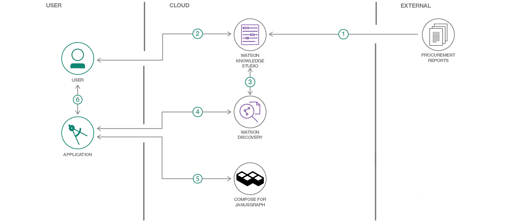

# Watson Knowledge Studio-Discovery-BM Graph

In this code pattern we will be creating a complete end to end solution for a procurement use case. Currently customers perform analysis of various market reports on their own or hire experts to make procurement decision. These experts analyze reports captured from data sources, a process that can be time consuming and prone to human error. This could potentially cause a chain effect of issues that may impact production.

By using our intelligent procurement system, based on Watson Discovery, a customer can receive expert analysis more quickly and accurately. The customer must first train the model with various use cases (via reports) to receive accurate results. The target end user of this system is a person working in a procurement role at a company.

As a developer going through this code pattern, you will learn how to:

* Configure Watson Discovery to ...
* Import a model to Watson Knowledge Studio
* View the dependencies of a procurement type system using ...

As an end user, you will be able to:

* Query suppliers for a specific commodity
* Retrieve information about a supplier and their facility available
* Query to retrieve supplier constraints
* Query supply status based on region

### Watson Discovery with and without Watson Knowledge Studio

To understand the significance of Watson Knowledge Studio (WKS) in this example we will look at the output extracted from Watson Discovery when using with WKS and without using WKS.

Waston Discovery output without WKS:

```
......
"text": "Asahi Kasei Corp",
"relevance": 0.227493,
"type": "Company"
.......

"text": "Kawasaki",
"relevance": 0.274707,
"type": "Company"
.......
```

Watson  Discovery output with WKS:
```
.......
"id": "-E114",
"text": "Asahi Kasei Corp",
"type": "Supplier""
.......

"id": "-E119",
"text": "Kawasaki",
"type": "Facility"
.......
```

Looking at the output of Discovery without WKS we can see that `Asahi Kasei` and `Kawasaki` are identified as a `company`, this is expected as Discovery without WKS only performs basic Natural Language Understanding (NLU) processing, it cannot understand language specific to the procurement domain. However, if we use Watson Discovery with WKS we can see that `Asahi Kasei` is identified as a `supplier`, whereas `Kawasaki` is identified as a `facility`.

## Process Flow


The steps followed to create solution is as follows. For commands please refer Running the application on Bluemix section below.

#### Watson Knowledge Studio (WKS)
1. We build Type System specific to business domain/use case
2. We follow human annotation process to identify entities and relationship.
3. We create machine learning model and train the model till we are satisfied with model.
4. The corpus document from document tab can be exported which can be imported into new wks project if required.

#### Discovery Service
1. We create discovery service from bluemix account. The discovery has to be created under US South as services under US South are ONLY visible while deploying wks model into discovery.
2. We create collection with customized configuration which points to wks model id.

#### IBM Graph
1. We create graph for this use case by creating schema/initial data for bootstrapping graph.

#### Client Application
1. We create client application which calls Discovery Service
2. The output (json data) of discovery service is parsed and nodes and edges for the graph are created dynamically.

## Technical Architecture




## Included Components
* [Watson Knowledge Studio](https://console.bluemix.net/catalog/services/knowledge-studio): Build custom models to teach Watson the language of your domain.
* [Watson Discovery](https://console.bluemix.net/catalog/services/discovery): A cognitive search and content analytics engine for applications to identify patterns, trends, and actionable insights.
* [Compose for JanusGraph](https://console.bluemix.net/catalog/services/compose-for-janusgraph): JanusGraph is a scalable graph database optimized for storing and querying highly-interconnected data modeled as millions or billions of vertices and edges

# Steps

## Deploy the Machine learning model to Discovery


## Running the application on IBM Cloud

1. Click on the `Deploy to Bluemix` button below.

[](https://bluemix.net/deploy?repository=https://github.com/IBM/procurement-system)

## Running the application on locally

1. If you do not already have access to a Cloud Foundry PaaS, [sign up for Bluemix](https://console.ng.bluemix.net/registration/).

2. Download and install the [Cloud Foundry CLI](https://github.com/cloudfoundry/cli).

3. Clone the app to your local environment from your terminal using the following command:

```
git clone https://github.com/IBM/procurement-system.git
```

4. Change into the newly created directory:

```
cd ProcurementSystem
```

5. Open the `manifest.yml` file and change the `host` value to something unique. The host you choose will determine the subdomain of your application's URL.

6. Connect to Bluemix in the command line tool and log in.

```
cf api <API_URL> # e.g. https://api.ng.bluemix.net
cf login
```

7. Create an instance of the IBM Graph service.

```
cf create-service "IBM Graph" Standard ProcurementSystemGraph
cf create-service-key ProcurementSystemGraph ProcurementSystemGraph
```

8. Create an instance of the Discovery Service.
```
cf create-service discovery standard ProcurementSystemDiscovery
cf create-service-key ProcurementSystemDiscovery ProcurementSystemDiscoveryServiceKey
cf service-key ProcurementSystemDiscovery ProcurementSystemDiscoveryServiceKey
```

9. Push the app.
```
cf api <API_URL> # e.g. https://api.ng.bluemix.net
cf login
cf push
```
