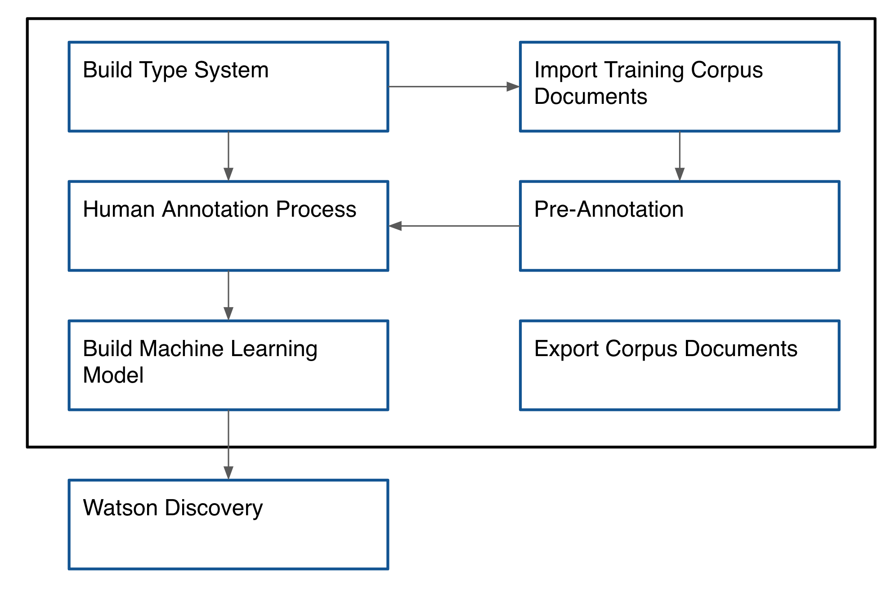
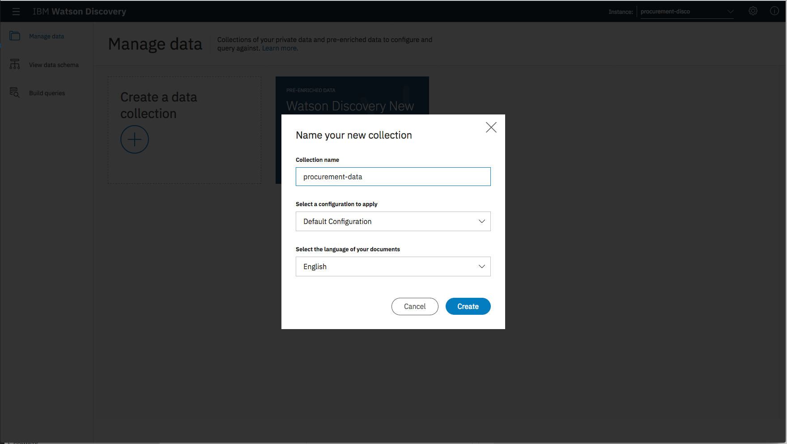

[](https://travis-ci.org/IBM/procurement-analysis-with-wks)

# Creating a smarter procurement system with Watson Knowledge Studio and Watson Discovery

In this code pattern we will be creating a complete end-to-end solution for a procurement use case. Currently, customers perform analysis of various market reports on their own or hire experts to make procurement decisions. These experts analyze reports captured from data sources, a process that can be time consuming and prone to human error, which could potentially cause a chain effect of issues that can impact production.

By using our intelligent procurement system, based on Watson Knowledge Studio (WKS) and Watson Discovery, a customer can receive expert analysis more quickly and accurately. The customer must first train the WKS model with various use cases (via reports) to better catagorize and structure the data so that Watson Discovery can deliver more accurate results. The target end user of this system is a person working in a procurement role at a company.

The data we will be using for this Code Pattern comes from newsletters retrieved from [Borica](http://www.borica.com/Hymer/hymer_newsletter.aspx), a global specialty chemical company. The newsletters contain information regarding global market suppliers, such as facility status, and supply capacities and shortages.

As a developer going through this code pattern, you will learn how to:

* Build a data model in Watson Knowledge Studio.
* Import that model into Watson Discovery.
* Graph the dependencies of a procurement type system. 

As an end user, you will be able to:

* Query suppliers for a specific commodity.
* Retrieve information about a supplier and their facility available.
* Query to retrieve supplier constraints.
* Query supply status based on region.

### Watson Discovery with and without Watson Knowledge Studio

To highlight the significance of using Watson Knowledge Studio (WKS) in this example, we will look at the output extracted from Watson Discovery both with and without the use of the WKS model.

Waston Discovery output without WKS:

```
......
"text": "Asahi Kasei Corp",
"relevance": 0.227493,
"type": "Company"
.......

"text": "Kawasaki",
"relevance": 0.274707,
"type": "Company"
.......
```

Watson  Discovery output with WKS:
```
.......
"id": "-E114",
"text": "Asahi Kasei Corp",
"type": "Supplier""
.......

"id": "-E119",
"text": "Kawasaki",
"type": "Facility"
.......
```

Looking at the output of Discovery without WKS, we see that `Asahi Kasei` and `Kawasaki` are both identified as a `company`. This is expected as Discovery without WKS only performs basic Natural Language Understanding (NLU) processing, and it doesn't understand language specific to the procurement domain. However, if we use Watson Discovery with WKS we can see that `Asahi Kasei` is identified as a `supplier`, whereas `Kawasaki` is identified as a `facility`.

## Flow


1. Load type system and corpus files into Watson Knowledge Studio.
2. A user generates a model by training and evaluating data.
3. The WKS model is deployed to Watson Discovery.
4. Application queries Watson Discovery for procurement data.
5. Application sends procurement data to JanusGraph to build a graph.
6. A user uses the app to select a query to perform, which retrieves the graph data from JanusGraph.

### How does Watson Knowledge Studio work?

The image below explains the process of how Watson Knowledge Studio works in light detail. For greater detail see Steps [4. Upload Type System](#4-upload-type-system) through [9. Deploy the machine learning model to Watson Discovery](#9-deploy-the-machine-learning-model-to-discovery).



The process is as follows:

* We build a Type System specific to the business domain/use case.
* We follow human annotation process to identify entities and relationships.
* We create a machine learning model and train the model till we are satisfied with the results.
* The corpus document can be exported and used in a new WKS project, if required.
* We create a Watson Discovery service from an IBM Cloud account. Note that the service has to be created under the `US South` region so that our WKS model can be used with it.
* We create a discovery collection with a customized configuration pointing to the WKS model id.

### Technical Architecture

This image shows the relationships and data flows between the major components of this Code Pattern:

> Note: In the image below, NLU is synonomous with Discovery. Either can be used to extract entities and relationships from data sources (both structured and unstructured). 


## Included Components
* [Watson Knowledge Studio](https://console.bluemix.net/catalog/services/knowledge-studio): Build custom models to teach Watson the language of your domain.
* [Watson Discovery](https://console.bluemix.net/catalog/services/discovery): A cognitive search and content analytics engine for applications to identify patterns, trends, and actionable insights.
* [Compose for JanusGraph](https://console.bluemix.net/catalog/services/compose-for-janusgraph): JanusGraph is a scalable graph database optimized for storing and querying highly-interconnected data modeled as millions or billions of vertices and edges

# Steps

1. [Clone the repo](#1-clone-the-repo)
2. [Create IBM Cloud services](#2-create-ibm-cloud-services)
3. [Create a Watson Knowledge Studio workspace](#3-create-a-watson-knowledge-studio-workspace)
4. [Upload Type System](#4-upload-type-system)
5. [Import Corpus Documents](#5-import-corpus-documents)
6. [Create an Annotation Set](#6-create-an-annotation-set)
7. [Create a Task for Human Annotation](#7-create-a-task-for-human-annotation)
8. [Create the model](#8-create-the-model)
9. [Deploy the machine learning model to Discovery](#9-deploy-the-machine-learning-model-to-discovery)
10. [Create and Configure a Watson Discovery Collection](#10-create-and-configure-a-watson-discovery-collection)
11. [Configure credentials](#11-configure-credentials)
12. [Run the application](#12-run-the-application)
13. [Deploy and run the application on IBM Cloud](#13-deploy-and-run-the-application-on-ibm-cloud)

## 1. Clone the repo

```
git clone https://github.com/IBM/procurement-analysis-with-wks
```

## 2. Create IBM Cloud services

Create the following services:

* [**Watson Discovery**](https://console.bluemix.net/catalog/services/discovery)
* [**Watson Knowledge Studio**](https://console.bluemix.net/catalog/services/knowledge-studio)
* [**Compose for JanusGraph**](https://console.bluemix.net/catalog/services/compose-for-janusgraph)

## 3. Create a Watson Knowledge Studio workspace

Launch the **WKS** tool and create a new **workspace**.


## 4. Upload Type System

A type system allows us to define things that are specific to our procurement data. The type system controls how content can be annotated by defining the types of entities that can be labeled and how relationships among different entities can be labeled.

To upload our pre-defined type system, from the **Access & Tools -> Entity Types** panel, press the **Upload** button to import the **Type System** file  [data/wks-resources/types-36a431a0-f6a0-11e7-8256-672fd3d48302.json](data/wks-resources/types-36a431a0-f6a0-11e7-8256-672fd3d48302.json) found in the local repository.


This will upload a set of **Entity Types** and **Relation Types**.


## 5. Import Corpus Documents

Corpus documents are required to train our machine-learning annotator component. For this Code Pattern, the corpus documents will contain example procurement documents.

From the **Access & Tools -> Documents** panel, press the **Upload Document Sets** button to import a **Document Set** file. Use the corpus documents file [data/wks-resources/corpus-36a431a0-f6a0-11e7-8256-672fd3d48302.zip](data/wks-resources/corpus-36a431a0-f6a0-11e7-8256-672fd3d48302.zip) found in the local repository.

> NOTE: Uploading the corpus documents provided in this Code Pattern is not required, but recommended to simplify the annotation process (all provided documents will come pre-annotated). An alternative approach would be to is to upload standard text files and perform the annotations manually.

> NOTE: Select the option to "Upload corpus documents and include ground truth (upload the original workspace's type system first)".


## 6. Create an Annotation Set

Once the corpus documents are loaded, we can start the human annotation process. This begins by dividing the corpus into multiple document sets and assigning the document sets to human annotators (for this Code Pattern, we will just be using using one document set and one annotator).

From the **Access & Tools -> Documents** panel, press the **Create Annotation Sets** button. Select a valid **Annotator** user, and provide a unique name for **Set name**.


## 7. Create a Task for Human Annotation

Add a task for human annotation by creating a task and assigning it annotation sets.

From the **Access & Tools -> Documents** panel, select the **Task** tab and press the **Add Task** button.


Enter a unique **Task name** and press the **Create** button.

A panel will then be displayed of the available annotation sets that can be assigned to this task. Select the **Annotation Set** you created in the previous step, and press the **Create Task** button.


### 7.1 Start the Human Annotation task

Click on the task card to view the task details panel.


Click the **Annotate** button to start the **Human Annotation** task.


If you select any of the documents in the list, the **Document Annotation** panel will be displayed. Since we previously imported the corpus documents, the entity and relationship annotations are already completed (as shown in the following examples). You can annotate mentions (occurrences of words/phrases which can be annotated as an entity) to play around, or you can modify one by annotating mentions with a different entity.


### 7.2 Submit Annotation Set

From the **Task** details panel, press the **Submit All Documents** button.


All documents should change status to **Completed**.


Press **Change Task** button to toggle back to the **Task** panel, which will show the completion percentage for each task.


From the **Access & Tools -> Documents** panel, select the **Task** tab and select the task to view the details panel.


Select your **Annotation Set Name** and then press the **Accept** button. This step is required to ensure that the annotation set is considered **ground truth**.

> NOTE: The objective of the annotation project is to obtain ground truth, the collection of vetted data that is used to adapt WKS to a particular domain.


**Status** should now be set to **COMPLETED**.


## 8. Create the model

Go to the **Model Management -> Performance** panel, and press the **Train and evaluate** button.


From the **Document Set** name list, select the **Annotation Set Name** you created previously and press the **Train & Evaluate** button.


This process may take several minutes to complete. Progress will be shown in the upper right corner of the panel.

> Note: In practice, you would create separate annotation sets (each containing thousands of messages) for training and evaluation.

Once complete, you will see the results of the train and evaluate process.


## 9. Deploy the machine learning model to Discovery

Now we can deploy our new model to the already created **Discovery** service. Navigate to the **Versions** menu on the left and press **Take Snapshot**.


The snapshot version will now be available for deployment to Discovery.


To start the process, click the **Deploy** button associated with your snapshot version.

Select the option to deploy to **Discovery**.


Then enter your IBM Cloud account information to locate your **Discovery** service to deploy to.


Once deployed, a **Model ID** will be created. Keep note of this value as it will be required later in this Code Pattern.


> NOTE: You can also view this **Model ID** by pressing the **WDS** button listed with your snapshot version.

## 10. Create and Configure a Watson Discovery Collection

Launch the **Watson Discovery** tool. Create a **new data collection**
and give the data collection a unique name.



From the new collection data panel, under `Configuration` click the `Switch` button to switch to a new configuration file. Click `Create a new configuration` option.


Enter a unique name and press `Create`.

From the **Configuration Panel**, press the `Add enrichments` option. Ensure that the following **extraction** options are added: **Keyword**, **Entity**, and **Relation**.

Also, assign your **Model ID** to both the **Entity Extraction** and **Relation Extraction**.

> Note: These **Model ID** assignments are required to ensure your review data is properly enriched.


Close the **Add Ennrichments** panel by pressing `Done`.

Save the configuration by pressing `Apply & Save`, and then `Close`.

Once the configuration is created, you can proceed with loading discovery files.

From the new collection data panel, under `Add data to this collection` use `Drag and drop your documents here or browse from computer` to seed the content with one or more of the available procurment document files located in `data/disco-docs/`.


## 11. Configure credentials
```
cp env.sample .env
```
Edit the `.env` file with the necessary settings.

#### `env.sample:`

```
# Replace the credentials here with your own.
# Rename this file to .env before starting the app.

# JanusGraph DB 
GRAPH_DB_USERNAME=admin
GRAPH_DB_PASSWORD=<add_janusgraph_password>
GRAPH_DB_API_URL=<add_janusgraph_api_url>

# Watson Discovery
DISCOVERY_USERNAME=<add_discovery_username>
DISCOVERY_PASSWORD=<add_discovery_password>
DISCOVERY_ENVIRONMENT_ID=<add_discovery_environment_id>
DISCOVERY_CONFIGURATION_ID=<add_discovery_configuration_id>
DISCOVERY_COLLECTION_ID=<add_discovery_collection_id>
```

The settings can be found by navigating to the specific service instance from within the [IBM Cloud dashboard](https://console.bluemix.net/dashboard/apps).

For the JanusGraph entries, navigate to the `Service Credentials` panel for the your JanusGraph service instance. The values can be found in the `gremlin_console_yaml` section of the generated credentials. For example:

```
"gremlin_console_yaml": [
  "hosts: [portal-ssl204-25.bmix-dal-yp-299e7bd4.test1-ibm-com.composedb.com]\nport: 41590\nusername: admin\npassword: MASHDUVREXMCSZLR\nconnectionPool: { enableSsl: true }\nserializer: { className: org.apache.tinkerpop.gremlin.driver.ser.GryoMessageSerializerV1d0, config: { serializeResultToString: true }}",
]
```

In this case, you would set your values to:
```
GRAPH_DB_API_URL=https://portal-ssl204-25.bmix-dal-yp-299e7bd4.test1-ibm-com.composedb.com:41590
GRAPH_DB_PASSWORD=MASHDUVREXMCSZLR
```

## 12. Run the application

1. Install [Node.js](https://nodejs.org/en/) runtime or NPM.
1. Start the app by running `npm install`, followed by `npm start`.
1. Access the UI by pointing your browser at the host and port values returned by the `npm start` command. For example, `http://localhost:6003`.

## 13. Deploy and run the application on IBM Cloud

To deploy to the IBM Cloud, make sure you have the [IBM Cloud CLI](https://console.bluemix.net/docs/cli/reference/bluemix_cli/get_started.html#getting-started) tool installed. Then run the following commands to login using your IBM Cloud credentials.

```
cd procurement-analysis-with-wks
cf login
```

When pushing your app to the IBM Cloud, values are read in from the [manifest.yml](manifest.yml) file. Edit this file if you need to change any of the default settings, such as application name or the amount of memory to allocate.

```
---
applications:
- name: procurement-analysis-with-wks
  memory: 256M
  instances: 1
  path: .
  buildpack: sdk-for-nodejs
  random-route: false
```

Additionally, your environment variables must be set in your `.env` file as described above in the [Configure credentials](#11-configure-credentials) section.

To deploy your application, run the following command.

```
cf push
```

> NOTE: The URL route assigned to your application will be displayed as a result of this command. Note this value, as it will be required to access your app.

To view the application, go to the IBM Cloud route assigned to your app. Typically, this will take the form `https://<app name>.mybluemix.net`.

To view logs, or get overview information about your app, use the IBM Cloud dashboard.

# Sample UI layout


# Troubleshooting

* Click on a query results in no graph being shown. 

> This means that there is no current data to support the query. This Code Pattern was originally developed to use data from a supplier with very detailed reports. Unfortunately, due to licensing issues, the reporting data supplied with this Code Pattern is very limited. The queries listed in the UI should provide insight into what a typical procurement agent would find useful.

# Links
* [Watson Knowledge Studio](https://www.ibm.com/watson/services/knowledge-studio/)
* [Watson Discovery](https://www.ibm.com/watson/services/discovery/)

# Learn more

* **Artificial Intelligence Code Patterns**: Enjoyed this Code Pattern? Check out our other [AI Code Patterns](https://developer.ibm.com/code/technologies/artificial-intelligence/).
* **AI and Data Code Pattern Playlist**: Bookmark our [playlist](https://www.youtube.com/playlist?list=PLzUbsvIyrNfknNewObx5N7uGZ5FKH0Fde) with all of our Code Pattern videos
* **With Watson**: Want to take your Watson app to the next level? Looking to utilize Watson Brand assets? [Join the With Watson program](https://www.ibm.com/watson/with-watson/) to leverage exclusive brand, marketing, and tech resources to amplify and accelerate your Watson embedded commercial solution.

# License

[Apache 2.0](LICENSE)
